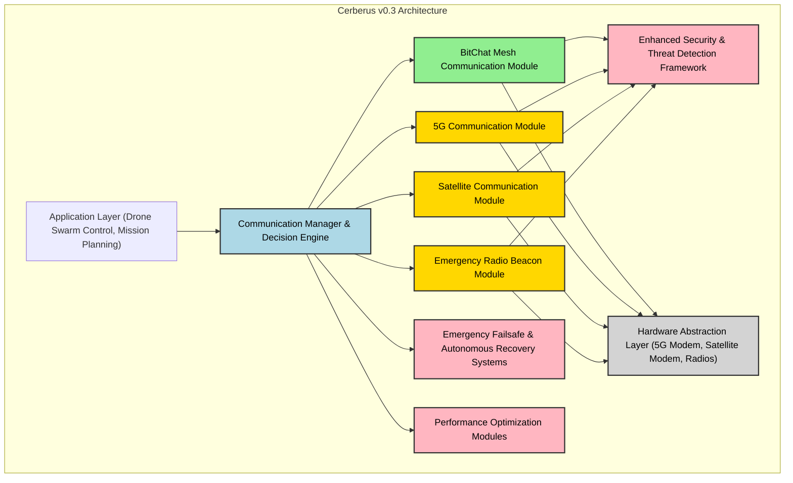

# Cerberus - Drone-Based Landslide Search and Rescue System

## **Project Overview**
This project aims to develop a drone-based system equipped with LiDAR, Ground Penetrating Radar (GPR), and other sensors to assist in locating individuals trapped in landslides. The system processes data from the sensors, performs real-time analysis, and provides actionable insights for rescue operations.

The system is modular, comprising a drone, onboard Raspberry Pi, an Arduino controller, and a laptop for advanced data processing.

---

## High-Level Architecture Diagram

